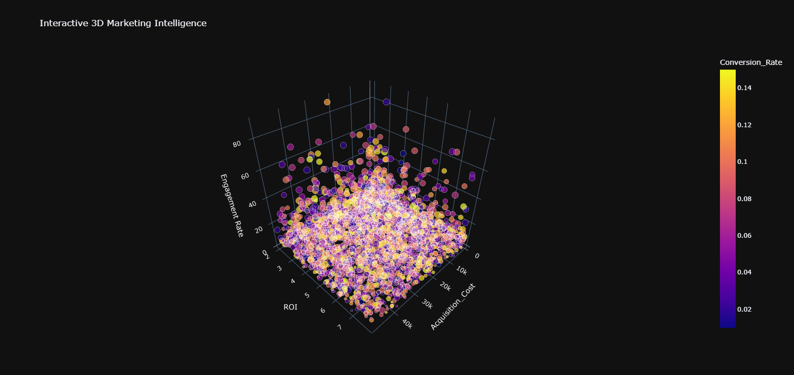

📊 Social Media & Marketing Campaign Analysis

An interactive marketing campaign analytics project built with Python, Pandas, Matplotlib, Seaborn, and Plotly.
The project analyzes campaign performance across ROI, conversion rate, engagement, clicks, impressions, acquisition cost, channels, campaign types, and customer segments.

The project combines traditional statistical visualizations with interactive 3D Plotly visualizations to explore campaign performance from multiple dimensions.

🖼️ Project Output

The following visualizations are included directly in this repository and will be displayed automatically on GitHub.

Interactive 3D Marketing Intelligence

3D Campaign Performance Flow

3D Bubble Campaign Intelligence

Marketing Campaign Hierarchy Analysis

🚀 Project Overview

The objective of this project is to transform raw marketing campaign data into meaningful performance insights.

The analysis covers:

Data loading and exploration

Missing-value inspection

Basic statistical analysis

Engagement-rate calculation

Conversion calculation

KPI calculation

Campaign-type performance analysis

Marketing-channel analysis

ROI distribution analysis

ROI heatmap analysis

Interactive 3D campaign intelligence

Campaign hierarchy analysis using a Sunburst chart

Campaign density analysis

📁 Project Files

.
├── 45.csv
├── social media analysis.ipynb
├── newplot.png
├── newplot (1).png
├── newplot (2).png
└── newplot (3).png

Dataset

45.csv contains 200,000 campaign records and 22 columns.

Notebook

social media analysis.ipynb contains the complete Python analysis and visualization workflow.

🛠️ Technologies Used

Technology

Purpose

Python

Data analysis and visualization

Pandas

Data loading, cleaning, grouping and aggregation

NumPy

Numerical operations and data generation

Matplotlib

Statistical visualizations

Seaborn

Advanced statistical plots

Plotly Express

Interactive 3D and hierarchical visualizations

Jupyter Notebook

Development and analysis environment

📌 Dataset Structure

The dataset contains the following main fields:

Column

Description

Campaign_ID

Unique campaign identifier

Company

Company running the campaign

Campaign_Type

Type of marketing campaign

Target_Audience

Target customer group

Duration

Campaign duration

Channel_Used

Marketing channel

Conversion_Rate

Campaign conversion-rate field

Acquisition_Cost

Campaign acquisition cost

ROI

Return on investment

Location

Campaign location

Language

Campaign language

Clicks

Number of clicks

Impressions

Number of impressions

Engagement_Score

Engagement score

Customer_Segment

Customer segment

Date

Campaign date

The notebook also creates/works with calculated fields such as:

Engagement Rate

Total Conversions

Cost Per Click (CPC)

Cost Per Acquisition

Total Acquisition Cost

🔍 Data Exploration

The notebook begins with:

Importing required libraries

Loading 45.csv

Viewing the dataset

Checking missing values

Generating descriptive statistics

The uploaded dataset contains:

200,000 rows

22 columns

5 companies

5 campaign types

6 marketing channels

5 locations

5 languages

5 customer segments

4 campaign durations

🧹 Data Preparation

The notebook performs several preprocessing operations.

Engagement Rate

The following calculation is used:

df['Engagement Rate'] = (df['Clicks'] / df['Impressions']) * 100

Total Conversions

The notebook calculates:

df['Total Conversions'] = df['Clicks'] * (df['Conversion_Rate'] / 100)

Missing Values

Missing values for selected calculated columns are filled with zero:

df['Total Conversions'] = df['Total Conversions'].fillna(0)
df['Cost Per Click (CPC)'] = df['Cost Per Click (CPC)'].fillna(0)
df['Cost Per Acquisition'] = df['Cost Per Acquisition'].fillna(0)

Acquisition Cost

The notebook removes the original Acquisition_Cost column and creates a new numeric acquisition-cost field using randomly generated values between 500 and 50,000 with NumPy seed 42.

Note: This means the later 3D visualizations use the newly generated acquisition-cost values rather than the original dollar-formatted values from the CSV.

📈 KPI Analysis

The notebook calculates the following KPIs:

Average Conversion Rate

Average Engagement Rate

Total Acquisition Cost

Average CPC

Average CPA

Total Conversions

Based on the uploaded dataset and the notebook's calculation logic:

KPI

Result

Average Conversion Rate

0.08

Average Engagement Rate

14.04%

Total Conversions

88,045.80

The original Acquisition_Cost values are dollar-formatted strings in the CSV. The notebook attempts numeric conversion after the KPI section, so the original values do not convert successfully at that stage. The notebook subsequently replaces the acquisition-cost column with generated numeric values for the interactive 3D analysis.

📊 Campaign Type Analysis

The notebook compares campaign types using:

ROI

Conversion Rate

Engagement Rate

Average ROI from the dataset:

Campaign Type

Avg. ROI

Avg. Conversion Rate

Avg. Engagement Rate

Influencer

5.0111

0.0803

14.03%

Search

5.0084

0.0800

13.99%

Display

5.0066

0.0801

14.13%

Email

4.9943

0.0798

13.95%

Social Media

4.9918

0.0801

14.10%

Key observation

Influencer campaigns have the highest average ROI in the analyzed dataset, while Social Media has the lowest average ROI among the five campaign types. The differences are relatively small.

📣 Marketing Channel Analysis

The notebook evaluates ROI and conversion rate across marketing channels.

Channel

Avg. ROI

Avg. Conversion Rate

Facebook

5.0187

0.0800

Website

5.0142

0.0802

Google Ads

5.0031

0.0802

Email

4.9965

0.0803

YouTube

4.9938

0.0799

Instagram

4.9887

0.0799

Key observation

Facebook has the highest average ROI in the channel analysis, while Instagram has the lowest average ROI.

📉 Statistical Visualizations

The notebook includes multiple visualizations for understanding campaign performance.

1. ROI by Campaign Type

A bar chart compares the average ROI of different campaign types.

2. ROI by Marketing Channel

A bar chart compares average ROI across marketing channels.

3. ROI Distribution by Campaign Type

A boxplot shows the spread and distribution of ROI for each campaign type.

4. ROI Density by Campaign Type

A violin plot provides a density-based view of ROI distribution.

5. ROI Spread with Data Points

A combined boxplot and stripplot shows both distribution and individual observations.

6. ROI Heatmap

A heatmap compares average ROI across:

Campaign Type × Marketing Channel

🌐 Interactive 3D Marketing Intelligence

The project also uses Plotly to create interactive 3D visualizations.

3D Marketing Intelligence

Axes:

X: Acquisition Cost

Y: ROI

Z: Engagement Rate

Color: Conversion Rate

Size: Clicks

This visualization provides a multidimensional view of campaign performance.

🔄 3D Campaign Performance Flow

The second 3D visualization uses a sampled dataset and represents campaign performance as 3D lines.

Dimensions:

Acquisition Cost

ROI

Engagement Rate

Campaign Type

🫧 3D Bubble Campaign Intelligence

This visualization analyzes:

X: Clicks

Y: Impressions

Z: ROI

Color: Campaign Type

Bubble Size: Conversion Rate

It helps explore the relationship between traffic, exposure, ROI, and conversion performance.

🌳 Marketing Campaign Hierarchy Analysis

A Plotly Sunburst chart is used to analyze campaign hierarchy.

The hierarchy is:

Campaign Type
      ↓
Channel Used
      ↓
Customer Segment

The visualization uses Clicks as the value and ROI as the color dimension.

🔥 Campaign Density Intelligence

The notebook also creates a Plotly density heatmap using:

Acquisition Cost

ROI

Conversion Rate

This provides a density-based view of campaign performance.

💡 Key Insights

Based on the uploaded dataset and notebook calculations:

The dataset contains 200,000 campaign records, providing a large sample for campaign-performance analysis.

The average conversion-rate field is approximately 0.08.

The calculated average engagement rate is approximately 14.04%.

Influencer has the highest average ROI among campaign types.

Facebook has the highest average ROI among the analyzed marketing channels.

ROI values are relatively close across campaign types, indicating no extremely large ROI gap between the categories.

The project uses sampling for Plotly 3D charts to make interactive visualization more manageable.

The Sunburst visualization provides a hierarchical view of campaign type, channel, and customer segment.

The combination of statistical plots and interactive 3D charts allows campaign performance to be examined from both summary and multidimensional perspectives.

⚠️ Important Data/Calculation Notes

This README documents the notebook as implemented.

A few calculation details should be kept in mind:

The CSV stores Acquisition_Cost as strings such as $16,174.00.

The notebook attempts pd.to_numeric() on this field without removing the $ and comma formatting.

Later, the original acquisition-cost column is dropped and replaced with random numeric values using np.random.randint(500, 50000, size=len(df)).

The conversion formula in the notebook divides Conversion_Rate by 100. Since the dataset contains values such as 0.04, this produces a very small conversion multiplier. This README reports the notebook's output rather than silently changing the calculation.

The 3D charts use samples of 2,000 or 3,000 records, while the Sunburst and density heatmap use 5,000 records.

▶️ How to Run the Project

1. Clone the repository

git clone https://github.com/your-username/social-media-marketing-analysis.git
cd social-media-marketing-analysis

2. Install dependencies

pip install pandas numpy matplotlib seaborn plotly jupyter

3. Start Jupyter Notebook

jupyter notebook

4. Open the notebook

social media analysis.ipynb

5. Make sure the dataset is in the same directory

45.csv

6. Run the notebook cells

Execute the cells from top to bottom to reproduce the analysis and visualizations.

📂 Recommended GitHub Structure

Social-Media-Marketing-Analysis/
│
├── README.md
├── 45.csv
├── social media analysis.ipynb
│
├── images/
│   ├── newplot.png
│   ├── newplot (1).png
│   ├── newplot (2).png
│   └── newplot (3).png
│
└── requirements.txt

For GitHub, it is recommended to place the four visualization images inside an images/ folder and update the README image paths accordingly.

📦 Requirements

numpy
pandas
matplotlib
seaborn
plotly
jupyter

🎯 Future Improvements

Possible improvements for the project include:

Correctly parsing currency-formatted acquisition costs

Validating the conversion-rate calculation

Adding time-series campaign analysis

Comparing campaign performance by location and language

Adding company-level performance analysis

Creating an interactive Plotly dashboard with filters

Adding statistical correlation analysis

Building predictive models for conversion or ROI

Adding customer-segment performance recommendations

Creating a Power BI or Streamlit dashboard from the cleaned dataset

👨‍💻 Project Purpose

This project demonstrates practical skills in:

Exploratory Data Analysis (EDA)

Data Cleaning

Feature Engineering

KPI Development

GroupBy Analysis

Statistical Visualization

Interactive 3D Visualization

Marketing Analytics

Business Intelligence

⭐ Conclusion

The Social Media & Marketing Campaign Analysis project provides a multidimensional view of marketing performance using a large campaign dataset. Traditional statistical visualizations highlight distribution and comparison, while interactive Plotly visualizations make it possible to explore relationships between ROI, acquisition cost, engagement, clicks, impressions, conversion rate, campaign type, channel, and customer segment.

The project can serve as a portfolio example for Data Analyst, Business Analyst, Marketing Analyst, and Data Science roles.

📜 License

This project is intended for educational and portfolio purposes.
